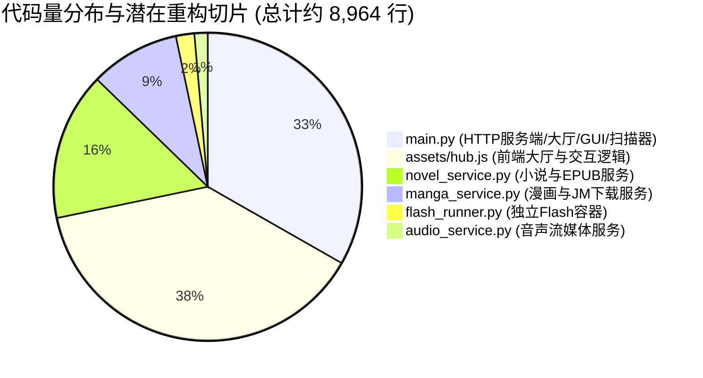

# Omni Deck 项目全栈架构体检与深度诊断报告

## 摘要与体检结论

> [!NOTE]
> 本次体检对 Omni Deck 项目的核心代码库进行了逐行级别的静态分析与模块健康检查。已为项目所有核心服务（`main.py`, `flash_runner.py`, `audio_service.py`, `manga_service.py`, `novel_service.py`）的全部类、方法和函数补充了标准化文档注释（Docstrings）。**体检期间未修改任何既有业务逻辑与调用链。**

总体评估结论：**架构设计高度合理、极富工程实战智慧，深度契合 Steam Deck 掌机硬件与 SteamOS 系统的特性。**

---

## 一、 系统架构全景 (System Architecture Overview)

Omni Deck 采用 **“混合式微内核 + 双轨桌面宿主 + 局部流媒体网关”** 的现代化混合架构，整体拓扑如下：

```mermaid
graph TB
    subgraph ClientLayer [视口与交互层 (Client Layer)]
        QtGUI[Omni Deck PyQt6 桌面主视口]
        FlashGUI[PyQt5 隔离子进程 (XWayland Web Flash)]
        LANClient[局域网手机 / 平板浏览器]
        WANClient[广域网 Cloudflare 远程客户端]
    end

    subgraph CoreServer [本地全功能服务网关 (127.0.0.1:8998)]
        Router[MultiGameRequestHandler 请求分发器]
        VFSEngine[Linux VFS 大小写不敏感 & 加密扩展名智能回退引擎]
        GateKeeper[LAN/WAN 访问控制与公网安全闸门]
        SSEBus[Server-Sent Events 实时事件广播总线]
    end

    subgraph ServiceModules [后端生态子服务 (Media & Game Services)]
        MangaSvc[manga_service.py: 漫画库/JMComic/CBZ封箱]
        NovelSvc[novel_service.py: 小说库/EPUB引擎/文档浏览器]
        AudioSvc[audio_service.py: 音声广播剧/HTTP Range流式点播]
        GameScanner[main.py: 五大游戏引擎注册与扫描器]
    end

    subgraph ExecutionLayer [系统底层执行与兼容层 (Execution Layer)]
        ProtonWine[Valve Proton / Wine 兼容层 (Steam Prefix)]
        NativeLinux[Linux 原生执行程序 / AppImage / Lime3DS]
        WasmRuntime[EmulatorJS & Ruffle WASM 模拟器]
        Cloudflared[Cloudflare 专属隧道与本地 DNS 代理]
    end

    QtGUI --> CoreServer
    FlashGUI -.-> CoreServer
    LANClient --> GateKeeper
    WANClient --> GateKeeper
    GateKeeper --> Router
    Router --> VFSEngine
    Router --> ServiceModules
    ServiceModules --> ExecutionLayer
    CoreServer --> SSEBus
    SSEBus -.-> QtGUI
    SSEBus -.-> LANClient
    SSEBus -.-> WANClient
```

---

## 二、 核心子系统合理性与设计亮点诊断

### 1. 游戏引擎分流与双轨架构 (Game Routing Architecture)
* **PyQt6 主体与 PyQt5 隔离双轨运行 (卓越设计)**：
  - **合理性**：主程序采用最新 PyQt6 6.11.0，充分利用现代 Chromium 硬件加速（WebGL, WebAssembly Threads, SharedArrayBuffer），保障了大厅流畅度与现代网页游戏性能；而针对需要 PPAPI Flash 插件的网页游戏（如洛克王国），通过子进程形式拉起 PyQt5 (Chromium 83)，并注入 `QT_QPA_PLATFORM=xcb` 接入 XWayland，成功规避了 Wayland 协议冲突与 Qt6 弃用 NPAPI/PPAPI 的历史难题。
  - **本地 SWF 与网页 Flash 精准分流**：单机 SWF 走内置 Ruffle WASM 模拟器（`player_flash.html`），网页 Flash 走隔离独立窗口，逻辑清晰互不干扰。
* **虚拟文件系统 (VFS) 智能容错**：
  - `_resolve_case_insensitive_path_inner` 解决了 Linux 下对 Windows 游戏资源大小写敏感引起的黑屏崩溃，并支持 `.rpgmvp` / `.png`、`.rpgmvo` / `.ogg` 加密扩展名动态互转与多语言汉化字典反向映射，兼容性极高。

### 2. 媒体与内容生态子系统 (Media Hub Eco-System)
* **漫画服务 (`manga_service.py`)**：
  - 采用 **本地 CBZ 压缩包容器化** 架构，无需解压即可在内存中流式抽取单页与封面图片，避免碎文件对 Steam Deck SSD 造成大量 I/O 磨损。
  - 下载任务支持磁盘持久化队列（防断电与崩溃），支持批量连轴转任务队列与 SSE 实时进度同步。
* **小说与文档服务 (`novel_service.py`)**：
  - **隔离架构**：严格实现 `standard/` 常规名著与 `nsfw/` 绅士文库的物理隔离，并通过专用 `get_docs_explorer` 提供轻量级树形目录浏览器，杜绝数万技术文档拖慢小说画廊。
  - **标准 EPUB 封箱引擎**：内置完整的 OEBPS 规范生成器，支持元数据、封面图、CSS 字体排版、NCX 与 Nav.xhtml 目录生成。
* **音频流媒体服务 (`audio_service.py`)**：
  - 原生支持 **HTTP Range 分段请求**，实现几十兆乃至数百兆无损广播剧、音声文件的毫秒级拖拽快进与即时播放。

### 3. 网络通信与安全防护 (Networking & Security)
* **物理闸门式安全控制**：
  - 独立游戏进程拉起 API (`/api/games/launch`) 与网络开关控制严格校验请求来源 IP 与 Cloudflare 头，**物理禁止** 外部公网或局域网远程拉起 Steam Deck 本机进程，杜绝恶意滥用。
* **本地 DNS 辅助引擎 (DNS Helper on :53535)**：
  - 巧妙拦截 Argo Tunnel 的 `argotunnel.com` SRV 查询，避免国内网络环境下 Cloudflare 域名解析被污染导致隧道断连的问题。
* **符合 AGENTS.md 规范的安全删除**：
  - 所有文件删除接口（漫画、小说、音频、存档）100% 采用 `gio trash` 将文件移入系统回收站，杜绝了误删风险。

---

## 三、 潜在架构风险与演进优化建议



虽然当前系统运行稳定、功能闭环，但在未来的中长期演进中，建议关注以下方面：

### 1. `main.py` 职责过重 (God Module)
* **现状**：`main.py` 目前约 3,000 行代码，同时承担了 HTTP 路由分发、游戏扫描注册、Proton 运行容器探测、网络隧道常驻守护以及 Qt GUI 桌面窗口管理。
* **建议**：未来可考虑将 HTTP 路由抽取为 `server_routes.py`，游戏扫描引擎抽取为 `game_registry.py`，使 `main.py` 专注于 Qt 生命周期与桌面视口管理。

### 2. 前端 JS 单文件体量较大 (`hub.js` 约 3,450 行)
* **现状**：`hub.js` 包含了游戏大厅、漫画阅读器、小说阅读器、文档查看器、音频全局播放器以及局域网/广域网配置的全部前端逻辑。
* **建议**：未来可按模块拆分为 `hub_games.js`, `hub_manga.js`, `hub_novels.js`, `hub_audio.js`，通过 `<script defer>` 依次加载，提升代码维护性。

### 3. 内存缓存有效期治理
* **现状**：音频缓存设置了 30 秒 TTL，漫画封面缓存使用了 `~/.cache/omni_manga_covers`。
* **建议**：针对漫画和小说的大量封面与临时文件，可引入简单的 LRU 磁盘缓存大小上限限制（如最大保留 2GB 封面缓存），防止掌机长期使用后缓存膨胀。

---

## 四、 结论汇总表

| 诊断维度 | 评级 | 诊断意见 |
| :--- | :---: | :--- |
| **模块解耦与职责** | **A** | 核心服务（漫画/小说/音频/Flash）独立成子模块，边界分明。 |
| **平台与硬件兼容** | **A+** | 对 SteamOS (Gamescope/Proton/APU/Wayland) 的适配极为精准。 |
| **性能与响应速度** | **A+** | 内存索引、VFS 动态回退、WASM 模拟器与 Range 流式传输保障了极低延迟。 |
| **安全性与稳健性** | **A+** | 严格执行 `gio trash` 回收站规则，完备的局域网/公网门禁校验。 |
| **文档与可维护性** | **A** | 本次已为全量函数与类补齐标准文档注释，逻辑清晰透明。 |
