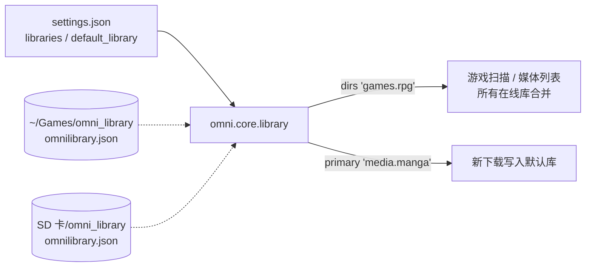
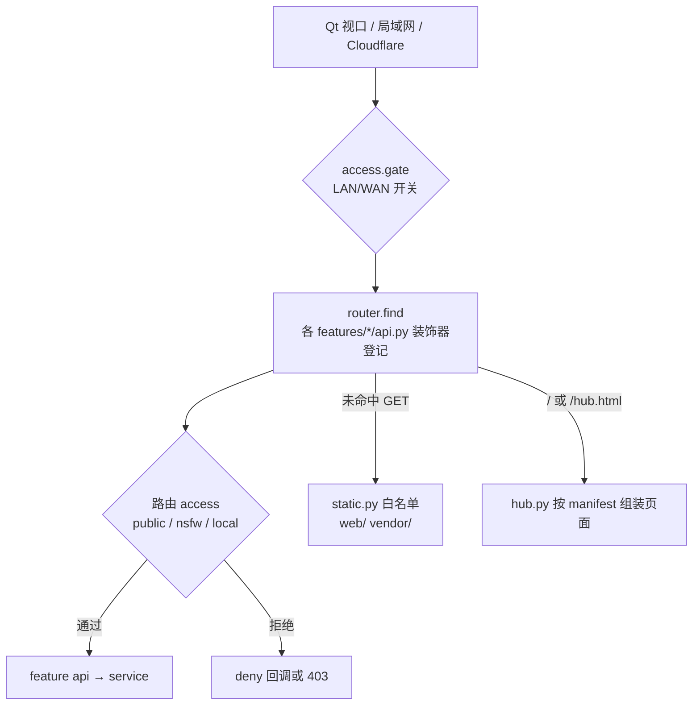

# Omni Deck v3 架构

## 1. 三层分离

| 层 | 位置 | 进 git | 说明 |
|---|---|---|---|
| 程序 | 仓库：`omni/` `web/` `vendor/` | ✅ | 代码、前端、内置第三方运行时 |
| 状态 | `var/`（`OMNI_STATE_DIR` 可改） | ❌ | `config/` 配置与密码哈希、`data/` 浏览器 profile 与点赞、`cache/` 索引缩略图、`logs/` |
| 资源 | 一个或多个资源库根目录 | ❌ | 游戏与媒体，按统一骨架存放 |

路径的唯一来源：程序/状态 → `omni/core/paths.py`；资源 → `omni/core/library.py`；外部工具与本机配置 →
`omni/core/settings.py`（`var/config/settings.json`）。`tests/test_path_guard.py` 禁止在别处写死路径。
配置里的路径以基础目录占位保存（`{games}/omni_library`、`{sd}/omni_library`、`{apps}/Lime3DS`…），基础目录在
`settings.dirs`，由 `settings.resolve()` / `settings.compact()` 互转。外部站点与本机回环地址的唯一来源是
`omni/core/endpoints.py`（`endpoints.url(键, 路径…)`；前端经 `window.OMNI_ENDPOINTS` 用 `Omni.url()`），
可在 settings 的 `endpoints` 覆盖。

## 2. 资源库

* `library.LAYOUT` 定义骨架（逻辑键 → 相对路径）；添加库、「修复骨架」都只补空目录，不动已有文件。
* 库标记 `omnilibrary.json` 记录库 id；SD 卡换挂载点会在 `/run/media` 下按 id 找回并修正路径；卡没插时库显示离线。
* 同名游戏出现在多个库时，排在前面的库生效，库管理页列出重复项。
* 小说/文档条目使用**逻辑路径**（`docs/…`、`novels/standard/…`），与所在库无关，阅读进度跨盘保留；解析时校验必须落在文档/小说目录内。
* 收件箱（`inbox_dir`，默认 `~/Downloads`）是浏览器插件与 MEGA 的下载落点，不是资源库。
* 游戏元数据在各游戏目录的 `omni.json`；资源库之外的程序登记在 `settings.external_games`。

## 3. 请求流程

* 路由默认访问级别取 manifest 中对应分区的 `access`，个别路由显式覆盖（如公开的技术文档阅读、仅本机的在线检索）。
* 静态文件只有白名单挂载，仓库本身不再对外暴露。
* 后台事件（下载进度、元数据巡检、网络开关）经 `omni.core.events` 广播到 `/api/events`（SSE）；各功能用 `events.on_init` 登记初始状态。

## 4. manifest 驱动的前端

`web/index.html` 是外壳；`omni/core/http/hub.py` 按 `omni/manifest.json`：

1. 渲染门户卡片、游戏分类标签、独立游戏子分类、媒体标签（`{{nav:*}}`）；
2. 按 `web.modules` 顺序拼入每个功能目录的 `header.html` / `subbar.html` / `view.html` / `overlays.html`
   （同一模块负责多个分区时，`view.html` 用 `{{s.字段}}` 按分区各渲染一次，例如三个短视频平台）；
3. 按 `core → modules → tail` 顺序引入 CSS/JS（带 mtime 版本号），并把 manifest 注入 `window.OMNI_MANIFEST`。

前端 `web/app/access.js` 由 manifest 生成 `ACCESS_RULES`；`web/app/shell.js` 只负责一二级切换，具体分区行为通过
`Omni.register(module, { activate, onScrollEnd, prewarm, onUnlock, onMediaEnter, onLibraryChanged })` 分派。

## 5. 启动与进程

`run.sh` 清掉 Steam 注入的环境 → `main.py` → `omni.app.main()`：
状态迁移（v2 → `var/`）→ 单实例探测（端口被占直接退出，绝不杀进程）→ HTTP 服务 → 游戏扫描 → 后台任务（广域网隧道、漫画元数据巡检）→ Qt 窗口。
所有子进程登记在 `omni.core.process`；SIGTERM / 关窗 / aboutToQuit 统一走 `process.shutdown()`：清子进程 → 释放端口 → 收后代 → `os._exit`。

## 6. 测试

* `tests/route_snapshot.py`：起独立端口 + 临时状态目录的无界面实例，请求全部路由，比对状态码/类型/JSON 结构（基线 `tests/snapshots/*.json` 在本机录制，含真实资源名，不进 git）。
* `tests/ui_smoke.py`：offscreen QtWebEngine 逐个进入各分区，检查渲染与 JS 报错，并截图。
* `tests/test_path_guard.py`：写死路径守卫。
