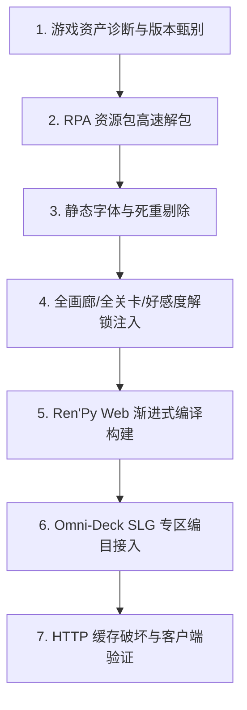

# Steam Deck 游戏 Web 化工程规范与改造实战指南
## （Ren'Py 引擎向 WebAssembly / Progressive Web 移植与全解锁）

---

### 一、核心架构与设计哲学

在 Omni-Deck 架构中，游戏 Web 化遵循 **“主机纯分发，端侧全计算”** 模式：
1. **Steam Deck（主机端）**：仅作为零负载的静态 HTTP 文件服务器（分发 HTML、JS、WASM、Zip 及媒体散装资源），不消耗任何 CPU/GPU 渲染算力。
2. **外部客户端（iPad / 手机 / 电脑浏览器）**：由浏览器原生 WebAssembly (WASM) 运行 Emscripten 封装的 Python 3 运行时与 Ren'Py 引擎，所有画面渲染（WebGL/Canvas）、音频解码与交互逻辑均在玩家设备端独立执行。
3. **存档隔离**：游戏的存档数据（Persistent 与 Saves）由客户端浏览器通过虚拟文件系统（MEMFS）自动同步至浏览器本地的 `IndexedDB`，不同设备各自独立、互不干扰。

---

### 二、标准改造流水线（七步工作流）



---

#### 第 1 步：游戏资产诊断与版本甄别
* **诊断目标**：
  * 确认底层引擎为 Ren'Py 8.x（Python 3 字节码架构），与本地 SDK（`renpy-8.5.3-sdk`）完全二进制兼容。
  * 评估资产体积：重点考察 `game/` 目录的实际大小（排除 Windows `.exe` 和 Linux 二进制文件），优先选取体积在 300MB ~ 800MB 内的轻量级作品。
* **检查命令示例**：
  ```bash
  grep "version =" "<游戏目录>/renpy/vc_version.py"
  ```

---

#### 第 2 步：RPA 资源包无损解包（Unpack）
* **原理解析**：
  * **不要反编译 `.rpyc`**：WASM 引擎原生执行的就是 `.rpyc` 字节码，反编译毫无必要。
  * **必须解包 `.rpa`**：`.rpa` 是类似 tar 的归档包。如果直接带 `.rpa` 运行，浏览器必须在启动前将整包（数百 MB）一次性全量下载至内存，导致首屏白屏几分钟。
  * 将 `images.rpa`、`audio.rpa` 解压为散装目录（`game/images/`、`game/audio/`），才能激活 Ren'Py Web 的**渐进式流式加载（Progressive Loading）**。
* **Python 解包核心代码**：
  ```python
  import os, pickle, zlib

  def unpack_rpa3(rpa_path, out_dir):
      with open(rpa_path, "rb") as f:
          l = f.read(40)
          offset = int(l[8:24], 16)
          key = int(l[25:33], 16)
          f.seek(offset)
          index = pickle.loads(zlib.decompress(f.read()))
          for rel_name, segments in index.items():
              out_file = os.path.join(out_dir, rel_name)
              os.makedirs(os.path.dirname(out_file), exist_ok=True)
              with open(out_file, "wb") as out_f:
                  for off, dlen, prefix in segments:
                      if prefix: out_f.write(prefix.encode('latin-1') if isinstance(prefix, str) else prefix)
                      f.seek(off ^ key)
                      out_f.write(f.read((dlen ^ key) - len(prefix)))
  ```

---

#### 第 3 步：字体优化与无用冗余剔除（暴降首屏体积）
* **痛点**：许多 Ren'Py 作品在汉化或开发时，将 Noto Sans SC 的 10 种字重（Thin、Light、Regular、Medium、Bold、Black、Variable 等共计 100MB+）全数塞入 `game/fonts/`，由于字体被打包进 `game.zip`，会导致启动包臃肿不堪。
* **做法**：
  1. 检索脚本（如 `Custom.rpy`、`gui.rpy`）中的字体引用；
  2. 将多余字重统一重定向到 `NotoSansSC-Regular.ttf` 与 `NotoSansSC-Bold.ttf`；
  3. 使用 `gio trash` 移除非必需的字体文件，启动包体积可从 80MB+ 直接压至 30MB 左右。

---

#### 第 4 步：全画廊/全进度/全角色好感度解锁注入
为提升玩家的即点即玩体验，可在构建前对脚本进行自动化免条件解锁注入：
1. **注入全局初始化解锁文件（`game/00_unlock.rpy`）**：
   ```renpy
   ## 最高优先级全局解锁注入
   init 999 python:
       # 1. 注入全部 Persistent 画廊与回放标记
       persistent.unlocked_gallery = True
       for attr in dir(persistent):
           if 'prologue' in attr or 'unlock' in attr or 'secret' in attr:
               setattr(persistent, attr, True)

       # 2. 全角色好感度拉满
       for var in ['lucy_aff', 'satana_aff', 'asmodia_aff', 'levia_aff', 'mia_aff', 'evelyn_aff', 'lilith_aff']:
           if var in globals():
               globals()[var] = 100
   ```
2. **画廊代码条件解绑（`gallery.rpy`）**：
   * 将 `if persistent.xxx:` 条件判断替换为 `if True:`，彻底移除 `locksceen.jpg` 锁定贴图。
3. **主菜单章节直达（Fast Travel）**：
   * 改造 `label start:`，加入交互式分章跳转菜单，支持直接选关。
4. **游戏内暂停菜单开放画廊**：
   * 在 `screens.rpy` 的 `screen navigation` 中解除 `if main_menu:` 对 Gallery 按钮的限制，使游戏中按 Esc 也能随时访问画廊。

---

#### 第 5 步：Ren'Py Web 渐进式编译构建
使用 SDK 内置的 `web_build` 命令行工具编译为 Web 工程：
```bash
~/Applications/renpy-8.5.3-sdk/renpy.sh \
  ~/Applications/renpy-8.5.3-sdk/launcher \
  web_build <游戏源码目录> --dest <输出目录>
```
* **输出产物特性**：
  * `game.zip`：仅包含脚本、GUI 贴图和必需字体（仅约 30MB）。
  * `game/images/` 与 `game/audio/`：分离为静态散装资源，支持 HTTP 按需异步拉取。
  * `renpy.wasm`、`renpy.data`、`renpy.js`：WebAssembly 核心运行时。
  * `index.html`：包含 HTML5 播放器与 IndexedDB 存档导入导出工具。

---

#### 第 6 步：Omni-Deck SLG 专区编目接入
1. **目录编号**：在 默认资源库的 `standalone_games/slg_games/` 下创建依次递增的编号目录（如 `008 - Harem x Family`、`009 - ...`）。
2. **封面与图标**：
   * 复制 `web-presplash.jpg` 为 `cover.png`（用作大厅网格封面海报）。
   * 复制 `icons/icon-512x512.png` 为 `icon.png`。
3. **核心扫描逻辑与展示名配置（`main.py`）**：
   * `register_slg_folder` 必须**优先检查 `index.html`**，将其识别为 `slg_engine: 'web'`。
   * 在 `DISPLAY_NAMES` 字典中添加游戏中文/双语名称映射。

---

#### 第 7 步：HTTP 缓存破坏与客户端多端验证
1. **防止客户端读旧缓存**：
   * 在 `index.html` 中设置带版本的 Zip 请求：
     ```javascript
     window.gameZipURL = 'game.zip?v=unlocked';
     ```
   * 递增 `service-worker.js` 中的 `cacheName`（如 `harem-x-family-v2`）。
2. **验证测试**：
   * 针对 `index.html`、`game.zip`、`renpy.wasm` 及任意 `game/images/*.jpg` 发送 HTTP HEAD 验证，确认返回 `200 OK`。

---

### 三、安全规范守则（严禁违规）

1. **删除文件守则**：严禁执行 `rm` 或 `rm -rf`，所有废弃文件/临时构建缓存必须使用 `gio trash <路径>` 移入回收站。
2. **源文件保护**：SD 卡（`/run/media/<用户>/<卷标>/`）原游戏文件在验证稳定前必须完好保留，严禁直接在 SD 卡原地破坏性覆写。
3. **Git 规范**：严禁随意提交大体积二进制资产，必须通过 `.gitignore` 与 `.gitkeep` 维护工程目录纯净。
